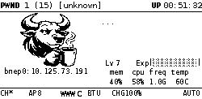

# Oxigotchi

> Pwnagotchi on steroids. AngryOxide + patched WiFi on Pi Zero 2W. No dongles needed.



---

## Rusty Oxigotchi — The Next Evolution

**Oxigotchi v2.x** is the battle-tested Python version you're reading about below. It works, it's stable, and it's already light-years ahead of stock pwnagotchi.

But the bull is getting an upgrade.

**Rusty Oxigotchi v3.0** is the full Rust rewrite — a single static binary that replaces Python, bettercap, and pwngrid entirely. ~5MB binary, ~10MB RAM, boot to scanning in under 5 seconds. No Python interpreter, no venv, no pip, no garbage collector. Just a lean, mean, handshake-capturing machine.

The codename is **Rusty** — because even an ox gets stronger with age, and this one is forged in Rust. Everything that makes Oxigotchi great (patched firmware, 6 attack types, bull faces, web dashboard, self-healing) gets rebuilt from scratch as native Rust modules compiled into one binary. Your SD card will last a decade.

Development is tracked in [docs/RUST_REWRITE_PLAN.md](docs/RUST_REWRITE_PLAN.md). The `rust/` directory has the initial scaffold.

---

## The Problem with Stock Pwnagotchi

Stock pwnagotchi on a Pi Zero 2W is barely functional. Here's what's actually happening under the hood:

The BCM43436B0 WiFi chip was never designed for packet injection. The nexmon patch that enables monitor mode is essentially duct tape — it forces the firmware into a state Broadcom never intended, and the chip fights back constantly. The PSM (Power Save Mode) watchdog fires every few seconds under injection load, the DPC (Deferred Procedure Call) handler panics when frame queues overflow, and memcpy operations trigger hard faults when the SDIO bus can't keep up. The result: **your WiFi module crashes every 2-5 minutes**. Bettercap tries to send a deauth frame, the firmware panics, the SDIO bus dies, wlan0mon disappears, pwnagotchi restarts, and the cycle repeats.

Most people's pwnagotchis spend more time recovering from crashes than actually capturing handshakes. It looks like a cute hacking toy on the outside, but when you dig into the logs, it's barely working — limping along with constant firmware resets, missing most handshakes because the radio is dead half the time.

And it's not just the WiFi. The crash cascade causes a chain of secondary problems:

- **SSH drops constantly** — You're SSH'd in trying to debug something, the firmware crashes, pwnagotchi restarts, your SSH session dies. Reconnect, wait for boot, crash again. Repeat.
- **`monstop` reloads the entire driver** — Every time pwnagotchi restarts, it calls `modprobe -r brcmfmac && modprobe brcmfmac`, which re-enumerates the SDIO bus. Do this enough times in quick succession and the SDIO bus dies permanently — only a full power cycle recovers it.
- **Restart storms kill the SD card** — Pwnagotchi has `Restart=always` in systemd with no rate limit. Crash → restart → crash → restart, over and over, writing logs and thrashing the SD card each time.
- **Boot takes forever** — On every restart, pwnagotchi re-parses its entire log file backwards using `FileReadBackwards`. With a 10MB log, this takes 30-60 seconds of pure I/O on the slow SD card. Every crash costs you a minute of downtime.
- **Bettercap eats memory** — Written in Go, bettercap uses ~80MB of RAM on a Pi Zero 2W that only has 512MB total. Combined with pwnagotchi's Python, you're constantly near memory pressure.
- **Captures are often junk** — Bettercap saves raw pcap files that may contain incomplete handshakes. You think you captured something, upload it to wpa-sec, and get nothing back. Community tools like `hashie-clean` and `pcap-convert-to-hashcat` exist specifically because this is such a common problem.
- **No real-time control** — Want to whitelist your home WiFi? Edit a TOML file over SSH. Want to see what networks are nearby? Check the tiny e-ink text. Want to download a capture? SCP it manually. The stock web UI shows a PNG of the e-ink display and a config editor. That's it.
- **The "AI" doesn't work** — The original pwnagotchi used reinforcement learning to optimize attacks. The jayofelony fork disabled it because it consumed too many resources and didn't actually improve capture rates. The mood faces that were supposed to reflect AI state just cycle randomly now.

On top of all that, bettercap only supports 2 attack types (deauth and PMKID), while modern tools like AngryOxide support 6 — including CSA, rogue M2, and anonymous reassociation that capture handshakes bettercap simply cannot get.

## What I Did About It

I reverse-engineered the BCM43436B0 firmware — mapped the ROM, found the crash handlers, traced the SDIO bus failures back to their root causes. I built a 7-layer firmware patch:

1. **PSM watchdog threshold** — raised from 5 to 255, preventing premature power-save panics
2. **DPC watchdog threshold** — same treatment, stops the deferred procedure handler from killing the radio
3. **RSSI threshold** — widened to prevent false signal-loss resets
4. **Fatal error wrapper** — intercepts error codes 5, 6, 7 at the firmware level and suppresses them instead of crashing
5. **HardFault recovery** — catches memcpy bus faults that previously killed the SDIO connection
6. **BCOL GTK rekey disable** — prevents a group key rotation that triggers a cascade failure under heavy TX load

The result: **27,982 injected frames in a 5-minute stress test, zero crashes.** The firmware that used to die every 2 minutes now runs indefinitely.

**This firmware patch benefits everyone** — not just Oxigotchi users. If you want to keep using stock bettercap in PWN mode, the patched firmware makes that stable too. No more constant crashes and restarts. I'm contributing these findings back to the nexmon project so the broader community benefits.

Then I integrated [AngryOxide](https://github.com/Ragnt/AngryOxide) — a Rust-based attack engine the community has been asking for. Nobody could get it running on the built-in WiFi because the firmware crashes were even worse under AO's heavier injection load. With the patched firmware, it runs flawlessly.

## The Numbers

| Metric | Stock Pwnagotchi | Oxigotchi v2.x (AO mode) | Oxigotchi v2.x (PWN mode) | Rusty Oxigotchi v3.0 (target) |
|--------|-----------------|--------------------|--------------------|-------------------------------|
| **WiFi crashes** | Every 2-5 minutes | Zero (v6 firmware, 27,982 frames tested) | Zero (same firmware patch) | Zero (same firmware patch) |
| **Attack types** | 2 (deauth, PMKID) | 6 (+ CSA, disassoc, anon reassoc, rogue M2) | 2 (stock bettercap, but stable) | 6 (AO as native Rust crate) |
| **Memory usage** | ~80 MB (bettercap) | ~15 MB (AO) | ~80 MB (bettercap) | ~5-10 MB (single binary) |
| **Capture quality** | Raw pcaps, often incomplete | Validated .pcapng + .22000 hashcat-ready | Raw pcaps (stock behavior) | Validated (same as AO mode) |
| **Boot time** | 2-3 min (parses full log) | ~20 sec (optimized boot) | ~20 sec (optimized boot) | <5 sec (no Python, no venv) |
| **Channel strategy** | Fixed hop | Smart autohunt with dwell | Fixed hop | Smart autohunt with dwell |
| **Language** | Go | Rust (AO) + Python (glue) | Go | 100% Rust |
| **Web dashboard** | Basic status page | Full control panel (15 cards, 22 API endpoints) | Basic status page | Full control panel (axum + htmx) |
| **Faces** | Korean text emoticons | 28 bull face PNGs | Korean text emoticons | 28 bull face PNGs (SPI direct) |
| **SD card lifespan** | ~1-2 years | ~5-10 years | ~1-2 years | 10+ years (near-zero writes) |
| **Binary size** | 150MB+ (Python venv) | 150MB+ (Python venv) | 150MB+ (Python venv) | ~5 MB static binary |

**Key point:** Even if you never use AngryOxide, the firmware patch alone makes stock pwnagotchi dramatically more stable. Switch to PWN mode and enjoy a bettercap that actually works.

## Why an Ox?

The name started practical: **Angry**Oxide → **Ox**ide → **Ox**. Then it stuck.

Pwnagotchi has its cute ghost face. Fancygotchi has dolphins and pikachus. But a hacking tool that brute-forces WiFi handshakes with 6 attack types and a patched firmware that refuses to die? That's not cute. That's a bull.

The ox is stubborn — it doesn't stop when the firmware crashes, it recovers. It's strong — 28,000 injected frames without breaking a sweat. And it has horns — when the bull is scanning, the horns point up (peaceful, grazing). When it captures a handshake, the horns come down (charging, triumphant).

28 hand-drawn bull faces show you exactly what your Oxigotchi is doing. No guessing, no random mood swings. Each face means something specific — from the sleeping bull at shutdown to the raging bull when the firmware crashes and recovers.

The pwnagotchi is a pet. The Oxigotchi is a workbull.

## Features

- **No dongles needed** — Most people give up on the built-in WiFi and buy a $15 Alfa dongle. Oxigotchi patches the Pi Zero 2W's BCM43436B0 chip for full monitor mode and TX injection. No external adapters, no USB hubs, no extra bulk. Plug in a battery, put it in your pocket, done.
- **6 attack types** — Deauth, PMKID, CSA, disassociation, anonymous reassociation, and rogue M2. Captures handshakes that bettercap simply cannot get.
- **Stable firmware** — 7-layer patch (v6), stress-tested with 27,982 injected frames and zero crashes. Works for both AO and bettercap modes.
- **Validated captures** — AO validates every capture before saving. No junk pcaps. Every `.pcapng` has a matching `.22000` hashcat-ready file. No need for cleanup tools like `hashie-clean` or `pcap-convert-to-hashcat`.
- **Web dashboard** — Full control from your phone. 15 cards: attack toggles, AP list with target/whitelist buttons, capture downloads, cracked passwords, system health, BT visibility control, shutdown/restart buttons, config editor, log viewer.
- **28 bull faces** — Custom 1-bit e-ink art for every mood and system state. Each face is a diagnostic indicator, not decoration.
- **Auto-crack integration** — Captures automatically upload to wpa-sec for cloud cracking. Cracked passwords appear in the dashboard. Whitelisted networks are never uploaded — your home WiFi stays private.
- **Unified XP system** — The EXP plugin works in both AO and PWN modes with persistent stats across reboots. In AO mode, a parser reads AngryOxide's capture files and emits the same association/deauth/handshake events that bettercap produces, so XP and leveling work identically in both modes. No captures lost, no stats reset when switching.
- **Smart Skip** — Auto-whitelists APs with existing captures, focusing on new targets.
- **Fast boot** — ~20 seconds from power-on to scanning (down from ~65s). Session cache, disabled bloat services, async diagnostics, merged WiFi services.
- **PiSugar 3 button controls** — Single press toggles Bluetooth tethering. Double press toggles AUTO/MANU mode. Long press switches AO/PWN mode. No SSH needed for basic control.
- **WiFi self-healing** — `wlan_keepalive` daemon sends probe frames to prevent SDIO bus idle crashes. `wifi-recovery.service` GPIO power-cycles the WiFi chip on boot if it fails to appear. No more dead radios.
- **Standalone Bluetooth tethering** — Decoupled from pwnagotchi's bt-tether plugin (which threw errors). Independent daemon, toggled via PiSugar button.
- **Reproducible image builds** — `tools/bake_v2.sh` builds a complete SD card image from the repo in one pass with full verification. (Rusty Oxigotchi v3.0 will ship with `bake_v3.sh` — a single binary flash, no venv, no pip.)
- **SD card saver** — Python pwnagotchi constantly writes logs, __pycache__, state files, and journal entries, killing SD cards in 1-2 years. Oxigotchi v2.x minimizes disk I/O with RAM-based logging, tmpfs mounts, and no Python overhead. Estimated 80-90% reduction in SD card wear — your card lasts 5-10+ years instead of 1-2. Rusty Oxigotchi v3.0 will eliminate Python entirely for near-zero disk wear — your SD card will outlive the Pi itself.
- **Backwards compatible** — All existing plugins work. Switch to PWN mode anytime for stock bettercap (now stable with our firmware patch). Your handshakes, config, and plugins are untouched.
- **Firmware rollback** — One command to restore original firmware.
- **Safe updates** — `apt upgrade` works without breaking anything. Kernel and firmware packages are held, apt hooks protect the patched firmware.

## Hardware You Need

> **This project is for the Raspberry Pi Zero 2W ONLY.**
>
> The firmware patches target the BCM43436B0 WiFi chip, which is specific to the Pi Zero 2W. **Other Pi models (Pi 3, Pi 4, Pi Zero W, Pi 5) have different WiFi chips and WILL NOT WORK.**

| Component | Required? | Notes |
|---|---|---|
| **Raspberry Pi Zero 2W** | **YES** | Must be the Zero **2** W (not the original Zero W). |
| **microSD card (16GB+)** | **YES** | Class 10 or faster. 32GB recommended. |
| **Micro USB cable** | **YES** | For power and data (USB tethering). |
| **Waveshare 2.13" V4 e-ink display** | Recommended | Shows the bull faces. The "V4" matters — other versions have different drivers. |
| **PiSugar 3 battery** | Optional | Makes it portable. Battery level shows on dashboard and triggers low-battery faces. |
| **3D-printed case** | Optional | Protects the stack. Many designs on Thingiverse. |

## Installation

### Option 1: Flash the Image (Recommended)

1. **Download the Oxigotchi image** from the [Releases](../../releases) section.
2. **Flash it to your microSD card** using [Raspberry Pi Imager](https://www.raspberrypi.com/software/) or [balenaEtcher](https://etcher.balena.io/).
3. **Insert the SD card** into your Pi Zero 2W.
4. **Windows users: install the USB gadget driver** — Download and run [rpi-usb-gadget-driver-setup.exe](https://github.com/jayofelony/pwnagotchi/releases) before connecting. macOS and Linux don't need this.
5. **Connect the Pi** via the micro USB **data** port (the one closest to the center, not the edge).
6. **Power on.** Wait about 30 seconds for the first boot.
7. **That's it.** The bull appears on the e-ink display and AngryOxide begins scanning automatically in AO mode (the default).

> **Default credentials** (change these after first boot):
> - SSH: `pi` / `raspberry`
> - Web UI: `changeme` / `changeme`
>
> To SSH in: `ssh pi@10.0.0.2`

### Option 2: Install on Existing Pwnagotchi (Advanced)

```bash
git clone https://github.com/CoderFX/oxigotchi.git /home/pi/Oxigotchi
cd /home/pi/Oxigotchi/tools
sudo python3 deploy_pwnoxide.py
```

The deployer is an 18-step automated installer. It backs up your existing firmware before making changes.

## First Boot

1. **0:00** — Power LED lights up. Boot splash shows the bull on e-ink.
2. **0:05** — Kernel loaded, splash visible.
3. **0:10** — Pwnagotchi initializes. Session data loads from cache.
4. **0:15** — Bull face changes to "awake." AngryOxide launches.
5. **0:20** — Scanning begins. Bull looks left and right. APs appear in dashboard.
6. **0:20+** — Attacks begin automatically. AO mode is the default.

> Boot time is ~20 seconds. First boot after flashing takes ~10s extra (no session cache yet).

## Web Dashboard

```
http://10.0.0.2:8080/plugins/angryoxide/
```

15 dashboard cards: system health, live e-ink preview, nearby networks with target/whitelist buttons, attack toggles, smart skip, rate control, channel config, targets, whitelist table, controls (mode switch + BT visibility + shutdown/restart + Discord), captures with type badges and download links, cracked passwords, log viewer, settings editor, installed plugins list.

Auto-refreshes every 5-30 seconds. Dark theme, mobile-friendly.

## Mode Switching

```bash
sudo pwnoxide-mode ao       # AngryOxide + bull faces (default)
sudo pwnoxide-mode pwn      # Stock bettercap + Korean faces (still stable with patched firmware!)
sudo pwnoxide-mode status   # Show current mode
sudo pwnoxide-mode rollback-fw  # Restore original firmware
```

Or **long-press the PiSugar 3 button** to toggle AO/PWN mode without SSH.

Your mode persists across reboots. AO mode is the default. Switching takes ~20 seconds.

**Both modes benefit from the firmware patch.** PWN mode gives you a stock pwnagotchi experience that's actually stable — no more constant WiFi crashes.

## Bull Faces — What They Mean

Every mood has its own bull. Here are all 28:

| Face | Name | What's Happening |
|---|---|---|
|  | **Awake** | System booting or starting a new epoch |
|  | **Scanning** | Sweeping channels, looking for targets |
|  | **Scanning (happy)** | Sweeping channels, good capture rate |
|  | **Intense** | Sending PMKID association frames |
|  | **Cool** | Sending deauthentication frames |
|  | **Happy** | Just captured a handshake |
|  | **Excited** | On a capture streak |
|  | **Smart** | Found optimal channel or processing logs |
|  | **Motivated** | High capture rate |
|  | **Sad** | Long dry spell, no captures |
|  | **Bored** | Nothing happening for a while |
|  | **Demotivated** | Low success rate |
|  | **Angry** | Very long inactivity or many failed attacks |
|  | **Lonely** | No other pwnagotchis nearby |
|  | **Grateful** | Active captures + good peer network |
|  | **Friend** | Met another pwnagotchi |
|  | **Sleep** | Idle between epochs |
|  | **Broken** | Crash recovery, forced restart |
|  | **Upload** | Sending captures to wpa-sec/wigle |
|  | **WiFi Down** | Monitor interface lost |
|  | **FW Crash** | WiFi firmware crashed, recovering |
|  | **AO Crashed** | AngryOxide process died, restarting |
|  | **Battery Low** | Battery below 20% |
|  | **Battery Critical** | Battery below 15%, shutdown soon |
|  | **Debug** | Debug mode active |
|  | **Shutdown** | Clean power off |

## Safety Features

- **Firmware rollback** — `pwnoxide-mode rollback-fw` restores original firmware at any time.
- **GPIO self-heal** — When the WiFi firmware crashes and the SDIO bus dies (error -22), the plugin automatically power-cycles the BCM43436B0 chip via GPIO 41 (WL_REG_ON), rebinds the MMC controller, reloads the driver, and restarts AO. No manual power cycle needed — even with PiSugar battery connected. This is the first pwnagotchi plugin that can recover from a dead SDIO bus without physical intervention.
- **WiFi keepalive** — `wlan_keepalive` daemon sends probe frames on wlan0mon to prevent SDIO bus idle crashes. Native C binary, minimal CPU overhead.
- **WiFi recovery on boot** — `wifi-recovery.service` GPIO power-cycles the WiFi chip if wlan0 doesn't appear within 4 seconds of boot.
- **AO watchdog** — Restarts crashed AO process with exponential backoff (5s → 5min).
- **Restart rate limiting** — Pwnagotchi capped at 3 restarts per 5 minutes.
- **USB lifeline** — SSH always available at `10.0.0.2` (or `192.168.137.2` with Windows ICS), even when WiFi is dead.
- **Mode escape hatch** — `pwnoxide-mode pwn` returns to stock pwnagotchi instantly. Or long-press PiSugar button.
- **Safe apt upgrades** — Kernel and firmware packages held, apt hooks auto-protect the patched firmware binary.

## Bluetooth Tethering

Bluetooth tethering is handled by a **standalone daemon** (not the pwnagotchi bt-tether plugin, which has been disabled). Toggle it with the PiSugar button:

- **Single press** — Toggle BT tethering ON/OFF
- **Dashboard** — Controls section has a BT Visible toggle

The daemon auto-pairs without PIN confirmation for ease of use.

**To stay safe:**

1. **Toggle BT off in public** — Single-press the PiSugar button or use the dashboard toggle.
2. Or use USB tethering only (`ssh pi@10.0.0.2` or `ssh pi@192.168.137.2`).

## FAQ

**Does this work on Pi 4 / Pi 3 / Pi Zero W / Pi 5?**
No. The firmware patches are for the BCM43436B0 chip in the Pi Zero 2W only. Other Pi models have different chips. No workaround exists.

**Can I use my existing pwnagotchi plugins?**
Yes. All standard plugins work. AO captures trigger the standard `on_handshake` event for downstream plugins (wpa-sec, wigle, exp, etc.).

**Can I switch back to stock pwnagotchi?**
Yes. `sudo pwnoxide-mode pwn` returns to bettercap with Korean faces. The firmware patch stays active, so bettercap is stable too. To fully remove the firmware patch: `sudo pwnoxide-mode rollback-fw`.

**Is this legal?**
These are WiFi security auditing tools for testing your own networks or networks you have explicit permission to test. Use responsibly.

**Are my captures actually crackable?**
Yes — AO validates every capture before saving. No junk pcaps. Every `.pcapng` has a matching `.22000` hashcat-ready file. No need for `hashie-clean` or `pcap-convert-to-hashcat`.

**How do I set up wpa-sec auto-cracking?**
Get a free API key from [wpa-sec.stanev.org](https://wpa-sec.stanev.org), add it in the dashboard's Discord/settings section or edit config.toml directly.

**The e-ink display is blank or garbled.**
Make sure you have the **Waveshare 2.13" V4** (not V1/V2/V3). Check `ui.display.type = "waveshare_4"` in config.

**How does XP and leveling work?**
Oxigotchi uses the EXP plugin to track your progress. XP works in both AO and PWN modes — your stats are persistent across reboots and mode switches. You earn +6 XP per capture: handshake (3 XP) + association (1 XP) + deauth (2 XP). In AO mode, a parser reads AngryOxide's `.pcapng` and `.22000` capture files and emits the same association/deauth/handshake events that bettercap produces, so the EXP plugin sees identical events regardless of which backend captured them. The level formula is `XP needed = level³ / 2` — early levels are fast but higher levels take more captures. AO earns XP **much faster** than stock bettercap because it attacks all APs in range simultaneously with 6 attack types. Stock pwnagotchi might get 1-3 handshakes per hour (6-18 XP). With AO, expect 5-20+ captures per hour (30-120+ XP) depending on AP density. You'll blow through the early levels in one walk.

**Does Smart Skip affect my XP?**
Yes — with Smart Skip ON, AO won't re-attack networks you already captured, so you won't earn duplicate XP from the same networks. Turn Smart Skip OFF if you want to maximize XP by farming the same APs repeatedly. Turn it ON if you want to focus on capturing new unique networks. You can toggle it anytime from the dashboard.

**Can I change the attack rate?**
The dashboard lets you set rate 1 (Quiet), 2 (Normal), or 3 (Aggressive). **Rate 1 is the default and recommended.** Rate 2 works well at home or in low-density areas, but in busy environments (walking through a city, near many APs) the heavy TX load can overwhelm the BCM43436B0 firmware — WiFi freezes and needs a reboot. This isn't a hard hardware limit — it's a firmware timing issue under high AP density + rapid channel hopping + movement. Rate 1 still uses all 6 attack types, just sends fewer frames per second. Rate 3 is experimental and will likely crash in most environments. If you plug in an external WiFi dongle (Alfa, RT5370, etc.) and configure AO to use it instead of the built-in chip, rate 2 and 3 work perfectly — the limitation is specific to the BCM43436B0.

**Does scanning more channels help?**
Not on the built-in WiFi. The BCM43436B0 firmware is more likely to crash when hopping across many channels — scanning all 13 with a short dwell time stresses the TX path and triggers the same firmware trap (EPC 0x204CA) as high rates. **Stick to channels 1, 6, 11** (the non-overlapping 2.4 GHz channels where 95% of APs live). You won't miss much, and your WiFi won't die mid-walk. If you use an external dongle (Alfa, etc.), scan all channels freely — external chips don't have this limitation.

**How long does the battery last?**
With PiSugar 3 (1200mAh): 3-4 hours active. The bull face warns at 20% and 15%.

## Maintenance & Support

This project is provided **as-is**. It's stable, tested (480 unit tests passing — 281 Python + 199 Rust — overnight soak test, 28,000-frame injection stress test), and production-ready.

**I will not be maintaining this project actively.** No issue tracking, no PR reviews. The code is GPL-3.0 — fork it, modify it, make it yours.

The pwnagotchi community is active and helpful: [Discord](https://discord.gg/pwnagotchi) · [Reddit](https://www.reddit.com/r/pwnagotchi/) · [Forums](https://community.pwnagotchi.ai/)

The bull will take care of itself.

## Support

If Oxigotchi has been useful to you and you'd like to support the work:

**BTC:** `bc1qnssffujsx5j2h7ep4wzyfa47azjlpwmaq8xtxk`

**ADA:** `addr1qymlyk49yaezevvm525ah6vey3sgah4clt83jmvcp60g5j25v6ukmh4628xn0hanrxwrae2j4huz3j36zt76ph40d44q703236`

No pressure — this project is free and always will be. But firmware reverse-engineering takes a lot of coffee.

## Credits

- [**Pwnagotchi**](https://pwnagotchi.ai) — The original WiFi audit pet by evilsocket and the pwnagotchi community
- [**AngryOxide**](https://github.com/Ragnt/AngryOxide) — Rust-based 802.11 attack engine by Ragnt
- [**Nexmon**](https://nexmon.org) — Firmware patching framework by the Secure Mobile Networking Lab
- [**wpa-sec**](https://wpa-sec.stanev.org) — Free distributed WPA handshake cracking service

## License

[GNU General Public License v3.0](LICENSE)

The WiFi firmware binary on the SD image is a patched version of Broadcom's BCM43436B0 firmware that ships with every Pi Zero 2W. No Broadcom source code is included in this repository.
